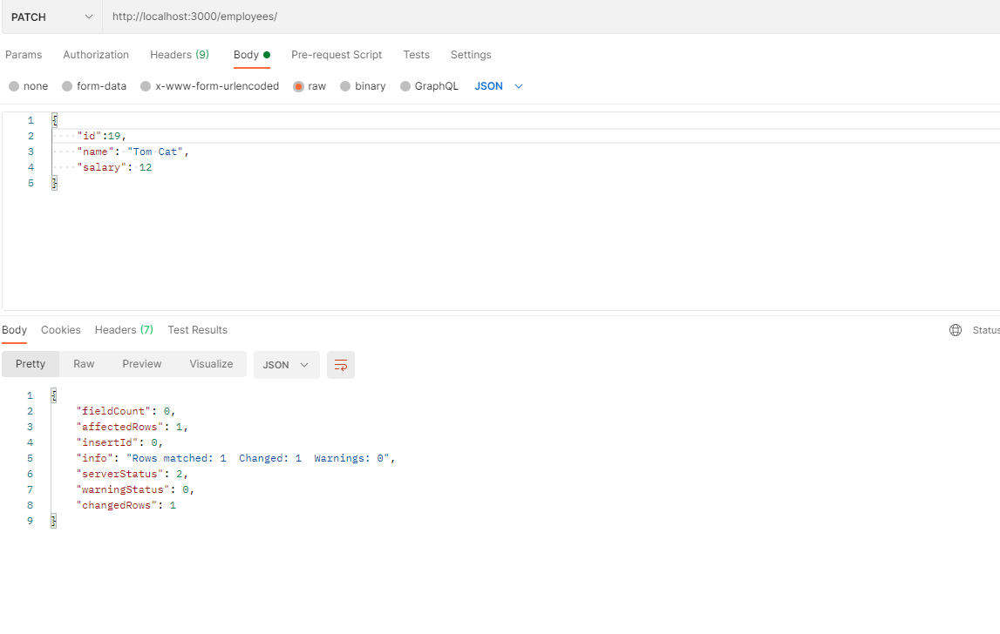

# Milestone 3
# CST 391
## Vrijesh Patel
## Basic Express API App with CRUD features  for CST 391

1. **GET /employees**: Retrieves all employees from the database. It returns a JSON response containing the details of all employees.

2. **GET /employees/:id**: Retrieves a specific employee based on the provided ID. It returns a JSON response containing the details of the employee with the specified ID.

3. **DELETE /employees/:id**: Deletes a specific employee based on the provided ID. It removes the employee from the database and returns a JSON response with the result.

4. **POST /employees**: Creates a new employee. It expects a JSON payload in the request body containing the employee's name and salary. The employee is inserted into the database, and a JSON response with the result is returned.

5. **PATCH /employees**: Updates an existing employee. It expects a JSON payload in the request body containing the updated employee's details, including the employee's ID, name, and salary. The employee in the database is updated based on the provided ID, and a JSON response with the result is returned.

6. **PUT /employees**: Updates or inserts an employee. It expects a JSON payload in the request body containing the employee's details, including the employee's ID, name, and salary. If an employee with the provided ID exists, it is updated in the database. Otherwise, a new employee is inserted. A JSON response with the result is returned.

